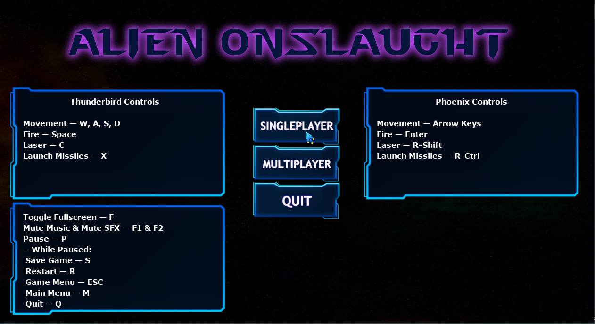

## Alien-Onslaught description:
- Alien-Onslaught is an action-packed game that will test your shooting skills and reflexes. The game is set in outer space, where you must shoot fleets of aliens to reach higher levels and increase your high score. With each level, the game becomes more challenging as the aliens become stronger and faster bosses are starting to appear, and more asteroids rain down from above.

- The game offers a range of game modes (e.g.: Boss Rush, Endless Onslaught), including single-player and multiplayer modes, where you can choose to battle it out with friends or take on the aliens alone. In game you can also get a variety of ship power-ups, including increased speed, bullet speed, and bullets allowed, as well as shields that protect you from enemy fire. It also includes a high score system where players can compete with others for the top spot on the leaderboard, Boss Fights, and more other features.

### Requirements:
- Python 3.7 or later
- Pygame 2.0 or later

## Controls:
#### Gameplay:
#### Player 1:
* Move: W, A, S, D
* Fire: Space
* Change Ship: 1, 2, 3
* Launch Missiles: Z
* Pause: P

#### Player 2:
* Move: Arrow Keys
* Fire: Enter
* Change Ship: Numpad 1, 2, 3
* Launch Missiles: R-Ctrl
* Pause: P

#### While the game is paused:
* R: Restart
* ESC: Return to game menu
* M: Return to main menu
* Q: Quit

## Game Images:

### More images can be found [here](https://github.com/KhadaAke/Alien-Onslaught/tree/main/game_assets/images/game_images)

<h2>Alien-Onslaught Changelog</h2>

### Version 3.0:
* Implemented a new feature: Now when defeating an alien there is a chance that it will split into a small number of smaller, baby aliens.
* Added a new mechanic in the game (exclusively for the multiplayer): After defeating the third Boss, if one of the players is not alive, he is revived with two lifes available.
* Implemented a new game mode: One Life Reign in which the players are really strong from the start of the game but they have only one life.
* Implemented a unique set of alien bullets for each type of alien present in the game.
* Code refactored to enhance the functionality of the main game class, allowing it to work for both singleplayer and multiplayer modes. This eliminates the need to create a separate class for singleplayer.
* Implemented winning screen for Cosmic Conflict.
* Added a new PVP game mode called Cosmic Conflict, where two players battle against each other in a 1v1 match.
* High score saving improved.
* Improved sound balance.
* Implemented a Victroy screen that appears in the Boss Rush when the players are defeating the last boss.
* Refactored the game code to improve its overall structure, readability, and maintainability by creating two base classes: Ship and Bullet, making it easier to create player ships and bullets and reducing code duplication.
* Reorganized the folder structure to enhance project organization and make it more navigable.

### Version 2.9:
* Updated the game mechanics so that when aliens hit the bottom of the screen, players now lose 100 points from their score instead of losing one life. This change was made because losing a life felt like too severe of a punishment.
* Modified the game speed-up scale and alien speed on all difficulties because the game was too hard even on the easiest mode.
* Implemented three new aliens.
* Players now have the ability to go back to the game menu when the game is paused.
* Implemented a custom mouse cursor that is now displayed while navigating through both the main and game menus.
* Refactored the game modes display functionality to improve user experience. Instead of displaying the description for the game modes when the game modes button is clicked, the description for each game mode now appears when the user hovers the mouse over the corresponding button.
* The intensity of the alien's firepower increases in correlation with the game level and/or selected difficulty.
* Added new background music for the Boss Rush and Endless Onslaught game modes.
* Removed the player position tracking feature from alien bullets because it was making the game less enjoyable.
* Moved sound related code from the main game class into a new SoundManager class to improve code maintainability
* Fixed a bug that caused some buttons to remain clickable even when they were not visible on the screen.
* The code has been refactored to enhance compatibility with both the singleplayer and multiplayer versions of the game. And by doing this, the duplicated code in the Singleplayer class has been reduced.
* New sound effects for aliens being destroyed.

### Version 2.8:
* Players can now delete all high scores with the click of a button. Additionally, if a player's name already exists in the high scores, they will be prompted to enter a new name.
* Enhanced the high score system to allow players to enter a personalized name for their achievement. This allows players to see their name next to their high score which is adding a sense of ownership and accomplishment.
* New sound effects for both the gameplay and UI and in addition to the new sound effects, there are also new penalties to make the game more challenging.
* Implemented sound effects for: Ship exploding, gift boxes, power ups, penalties, health and game over screen.
* Implemented loading screen.
* The game now features dynamic background music that changes as the player progresses through the different levels. The menu also has its own distinct background music.
* The alien bullets in the game have become more advanced, adapting to the player's movements and tracking their position to create a more challenging gameplay experience.
* Now the players are able to fire continuously while holding down their fire button.
* Implemented a new power that changes the ship size.
* Implemented missiles icons where the number of missiles is displayed on screen and a new penalty that gives to the normal aliens a shielded state for a period of time and for bosses 15 HP.
* Improved UI by adding a description for every game mode available in the game
* Code refactored
* Implemented two new powers, bonus points and invincibility.
* Implemented a new feature: Gift boxes now drop from the top of the screen, each containing different weapon for players to use.

### Version 2.7:
* Solved a bug that prevented the ships from playing their destroy animation when losing their last health.
* New background after level 25.
* Now when a player picks up a power, there is a chance for that power to be a penalty. Introduced two penalties: Reversed movement and disarm. The penalties are active for a short period of time.
* Moved all projectiles into a new module called 'projectiles' and refactored the code in the 'collision_detection' module.
* Implemented a new feature to the game which introduces a new weapon for players. Each player now starts with three missiles that can cause damage to multiple aliens when they explode. Additionally, a power-up has been included which increases the number of missiles available to the player.
* New power up that is available only in the Last Bullet game mode, remaining bullets increased.
* Implemented new power_ups, alien speed and alien bullet speed decreased.
* Created a new module 'game_modes' that manages the different game modes available in the game.
* Refactored code in multiple modules and created two new @dataclasses to hold values for different parts of the game.
* Improved UI, moved some buttons and added the game title in the Menu screen.
* Improved the high score system, now there are separate high scores for every game mode.
* Implemented a new game mode, Boss Rush: Players must fight different bosses at every level, each with their own unique designs and bullet patterns. With each level, the bosses become stronger and faster, making them more challenging.
* Created a new module, 'image_loader' which has functions to load images for aliens.

### Version 2.6:
* Implemented a new Boss fight and a new animation for power-ups being picked up.
* Implemented new animation for entities getting destroyed, and a new module 'frames' which contains constants for animations or images used in the game.
* New feature to enhance gameplay: player immunity after being hit! Now, when a player is hit, they will be granted a brief period of immunity to prevent them from taking another hit right away. This will give players a chance to recover and avoid getting hit again immediately after respawning. An animation will play during the immunity period, letting the players know they are invulnerable.
* Implemented a new game mode, Meteor Madness: Players must navigate a barrage of asteroids as each level progresses, the number of asteroids coming towards the player will increase, and their speed will become more relentless. Additionally, the player's speed will decrease, adding an extra layer of challenge to the game.
* New packages created:
"animations": This package contains modules for handling animations in the game.
"entities": This package includes modules for defining and managing game entities such as ships, asteroids, aliens, and power-ups.
"game logic": This package contains modules that handle the core game logic, such as collision detection, game settings, and scoring.
"ui": This package includes modules for managing the user interface (UI) of the game. It contains classes and functions for creating game buttons, scoreboards, and other UI elements.
"utils": This package contains modules for various utilities and helper functions used throughout the game and constants.
* Refactored code into new classes and modules
* Improvements to the code organization by grouping related modules and classes into new packages.

### Version 2.5:
* Created new modules: "game_utils" for common utility functions, "screen_manager" for managing screen resizing behavior, "game_buttons" for creating the game buttons, "animations" for animating elements on the screen, and "constants" for storing constants.
* Refactored code by grouping related functions and classes into new modules for improved organization.
* Implemented Game Modes:
* Last Stand: In the Last Stand game mode, the ship and bullet speeds decrease over time, making the game more difficult.
* The Endless game mode features fleets of aliens and asteroids that continuously appear, with the speed of the aliens and their bullets increasing over time.

### Version 2.4:
* Added minimum and maximum window sizes: 1260x700 and 1920x1080.
* Changed fleet creation so that aliens drop in rows from the top of the screen, and the number of aliens in each row increases with each level.
* Implemented high scores; when the game ends, the high score is saved, and players can view the top 10 high scores by clicking the "HIGH SCORES" button.
* Improved the code to make it more concise, refactored, and easier to read, and added more documentation.
* Changed the alien movement so that they randomly move in different directions.

### Version 2.3:
* Improved code readability and added more documentation, comments, and docstrings.
* Implemented boss fights: different bosses with different types of bullets.
* Added a ship warp animation when the game starts.
* Fixed a bug that occurred when the game window was resized.
* Improved the game's user interface.

### Version 2.2.1:
* Added the ability to pause the game.
* Fixed a bug in ship movement by using Python's "match case" instead of "if-elif-else".
* Players can now adjust the game's difficulty.
* Added new buttons: "Menu" and "Difficulty".

### Version 2.2:
* Added Game Over screen when the game ends.
* Displayed controls for both players on the screen.
* Improved the Start Menu with button images instead of text for Singleplayer, Multiplayer, Play, and Quit buttons.

### Version 2.1:
* Added new background images.
* Added a new power-up that increases the number of bullets the player can shoot.
* Added new animations for ship hitting an alien, asteroid, or alien bullet.

### Version 2.0:
* Introduced new animated aliens.
* Implemented new ship skins and the ability to switch between them.
* Added animated asteroids dropping from the top of the screen as the game progresses.

### Version 1.9:
* Added random alien shooting and a new power-up, the shield.

### Version 1.8:
* Added ship power-ups, including increased ship speed, bullet speed, and bullets allowed.
* Increased the strength of aliens as the player progresses to higher levels.

### Version 1.7:
* Made the game window resizable.
* Implemented new backgrounds that change as the game progresses.
* Added the option to choose Singleplayer or Multiplayer mode from the Start Menu.

# Credits

This is a list of assets used in the project that were not created by me, along with their respective authors:

### Music:
* Level soundtracks — by [Matthew Pablo](https://opengameart.org/users/matthew-pablo)
* Third phase song in Boss Rush — by [Juhani Junkala](https://www.free-stock-music.com/artist.juhani-junkala.html)
* Endless Onslaught soundtrack — by [Alexander Ehlers](https://opengameart.org/users/tricksntraps)
* Game over music — by [Otto Halmén](https://opengameart.org/users/otto-halm%C3%A9n)
* Menu music — by [yd](https://opengameart.org/users/yd)

### Sound Effects (SFx):
* UI Sound effects (click sound, quit sound) — by [Circlerun](https://opengameart.org/users/circlerun)
* Explosion SFx — by [Michael Kurinnoy](https://opengameart.org/content/space-battle-game-sounds-astromenace)
* Power-up, penalty, health SFx — by [phoenix1291](https://opengameart.org/users/phoenix1291)

### Images/Sprites:
* Ships/missiles — by [MillionthVector](http://millionthvector.blogspot.com/)
* Warp effect, bosses, shields, explosions and some bullets  — by [Skorpio](https://opengameart.org/content/warp-effect-2)
* Aliens — by [Gamedevtuts](https://opengameart.org/users/gamedevtuts)
* Powers and some bullets — by [JanaChumi](https://opengameart.org/users/janachumi)
* Most of the bullets — by [Wenrexa](https://opengameart.org/users/wenrexa)
* Alien Bullet — by [GameSupplyGuy] (https://gamesupply.itch.io/)